# Unreal Engine 5 内存管理深度解析

> 基于 UE 5.6 引擎源码（`Engine/Source/Runtime/Core` 与 `CoreUObject` 等模块）整理。
> 本文从 C++ 语言层、引擎层、UObject 系统、GC 与资源/资产管理几个维度，串联讲解 UE 是如何管理内存的。

---

## 目录

1. [总览与分层模型](#1-总览与分层模型)
2. [C++ 语言层：new / delete 是如何被劫持的](#2-c-语言层new--delete-是如何被劫持的)
3. [引擎层：FMemory / FMalloc / GMalloc 抽象](#3-引擎层fmemory--fmalloc--gmalloc-抽象)
4. [底层分配器实现：Binned / Mimalloc / TBB / Ansi](#4-底层分配器实现binned--mimalloc--tbb--ansi)
5. [容器分配策略：TArray/TMap 等的内存来源](#5-容器分配策略tarraytmap-等的内存来源)
6. [UObject 内存管理：从 NewObject 到对象表](#6-uobject-内存管理从-newobject-到对象表)
7. [Garbage Collection：可达性分析与增量回收](#7-garbage-collection可达性分析与增量回收)
8. [非 UObject 引用 UObject：FGCObject](#8-非-uobject-引用-uobjectfgcobject)
9. [资产/资源管理：Package、Linker、AsyncLoading](#9-资产资源管理packagelinkerasyncloading)
10. [BulkData 与流式资产（纹理/Mesh Streaming）](#10-bulkdata-与流式资产纹理mesh-streaming)
11. [GPU/RHI 资源的引用计数管理](#11-gpurhi-资源的引用计数管理)
12. [内存追踪与诊断：LLM、MemoryTrace、各种 Proxy](#12-内存追踪与诊断llmmemorytrace各种-proxy)
13. [总结：UE 中"对象"的生死全景图](#13-总结ue-中对象的生死全景图)

---

## 1. 总览与分层模型

UE 的内存管理是一个 **"分层 + 多种生命周期模型并存"** 的体系。
不同种类的"内存"，由不同子系统负责：

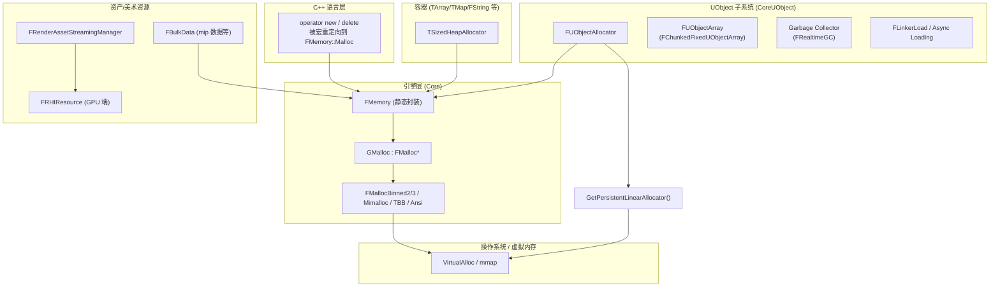

可以记住三条关键脉络：

| 脉络 | 适用范围 | 释放方式 |
|------|---------|---------|
| **CPU 通用堆** —— `FMemory::Malloc` → `GMalloc(FMalloc)` | 所有 C++ `new`、容器、临时 buffer、BulkData 原始数据 | `FMemory::Free` 显式释放（容器自动处理） |
| **UObject 堆 + GC** —— `FUObjectAllocator` + 可达性分析 | 一切 `UCLASS()` 实例、Asset 加载得到的对象 | GC 自动回收（不可达时） |
| **GPU 资源** —— `FRHIResource` + 引用计数（`TRefCountPtr`） | 纹理、Buffer、Shader 等 GPU 侧对象 | 引用归零后进入 RHI 删除队列异步释放 |

后续章节按这三条脉络逐个展开。

---

## 2. C++ 语言层：`new` / `delete` 是如何被劫持的

UE 把全局 `operator new` / `operator delete` 重定向到自己的 `FMemory`，而不直接调 CRT 的 `malloc`。

关键定义在 `Runtime/Core/Public/HAL/UnrealMemory.h` 的伴生文件，以及全局 new/delete 重载（`Engine/Source/Runtime/Core/Private/GenericPlatform/GenericPlatformMemory.cpp` 等）。

```cpp
// 等价形式（UE 通过 UE_USING_GLOBAL_NEW_DELETE 启用）
void* operator new  (size_t Size)                 { return FMemory::Malloc(Size); }
void* operator new[](size_t Size)                 { return FMemory::Malloc(Size); }
void  operator delete  (void* Ptr) noexcept       { FMemory::Free(Ptr);            }
void  operator delete[](void* Ptr) noexcept       { FMemory::Free(Ptr);            }
```

但有一个例外：**`FMalloc` 自己**不能用 `GMalloc` 来分配自己（鸡生蛋问题）。所以 UE 提供了 `FUseSystemMallocForNew` 基类，让分配器自身的对象走系统 `malloc`：

```cpp
// MemoryBase.h
class FUseSystemMallocForNew {
public:
    CORE_API void* operator new(size_t Size);    // 直接 ::malloc
    CORE_API void  operator delete(void* Ptr);   // 直接 ::free
    void* operator new[](size_t Size);
    void  operator delete[](void* Ptr);
};

class FMalloc : public FUseSystemMallocForNew, public FExec { ... };
```

这样 `new FMallocBinned2(...)` 走的是系统堆，不会递归依赖 `GMalloc`。

---

## 3. 引擎层：`FMemory` / `FMalloc` / `GMalloc` 抽象

### 3.1 接口分层

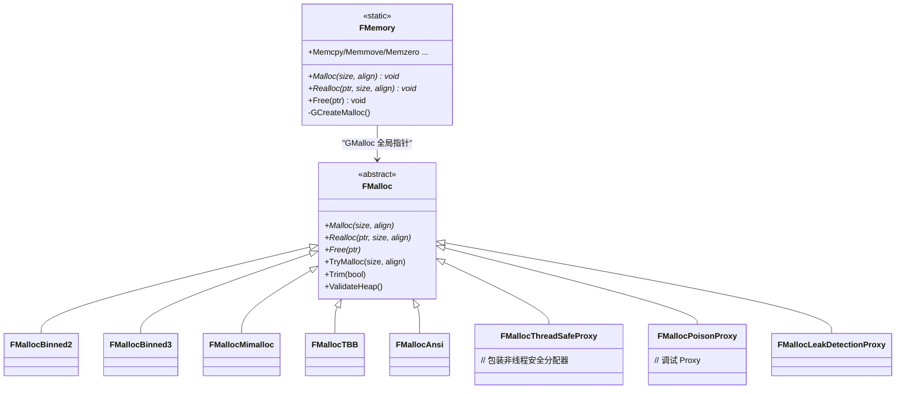

`FMalloc` 是抽象基类（`HAL/MemoryBase.h`），定义了：

```cpp
class FMalloc : public FUseSystemMallocForNew, public FExec
{
public:
    virtual void* Malloc (SIZE_T Count, uint32 Alignment = DEFAULT_ALIGNMENT) = 0;
    virtual void* Realloc(void* Original, SIZE_T Count, uint32 Alignment = DEFAULT_ALIGNMENT) = 0;
    virtual void  Free   (void* Original) = 0;

    virtual SIZE_T QuantizeSize(SIZE_T Count, uint32 Alignment);
    virtual void   Trim(bool bTrimThreadCaches);
    virtual void   SetupTLSCachesOnCurrentThread();
    virtual bool   IsInternallyThreadSafe() const { return false; }
    ...
};
```

### 3.2 全局 `GMalloc` 与延迟创建

`FMemory::Malloc` 是大多数代码真正调用的入口；它转发到 `GMalloc->Malloc(...)`。
`GMalloc` 不在程序启动前就初始化，而是 **首次访问内存时**懒加载，由 `GCreateMalloc()` 完成（`Runtime/Core/Private/HAL/UnrealMemory.cpp`）：

```cpp
static int FMemory_GCreateMalloc_ThreadUnsafe()
{
    UE::Private::GMalloc = FPlatformMemory::BaseAllocator();      // 1) 平台层选定基础分配器

    FPlatformMallocCrash::Get(UE::Private::GMalloc);              // 2) 注册 crash 时使用的备用分配器

#if UE_MEMORY_TRACE_ENABLED
    FMalloc* TraceMalloc = MemoryTrace_Create(UE::Private::GMalloc);
    if (TraceMalloc != UE::Private::GMalloc) { UE::Private::GMalloc = TraceMalloc; ... }
#endif

#if WITH_MALLOC_STOMP2
    UE::Private::GMalloc = FMallocStomp2::OverrideIfEnabled(UE::Private::GMalloc);
#endif

    if (!UE::Private::GMalloc->IsInternallyThreadSafe())
        UE::Private::GMalloc = new FMallocThreadSafeProxy(UE::Private::GMalloc); // 3) 包一层线程安全代理

#if MALLOC_VERIFY
    UE::Private::GMalloc = new FMallocVerifyProxy(UE::Private::GMalloc);
#endif
#if MALLOC_LEAKDETECTION
    UE::Private::GMalloc = new FMallocLeakDetectionProxy(UE::Private::GMalloc);
#endif
#if UE_USE_MALLOC_FILL_BYTES
    UE::Private::GMalloc = new FMallocPoisonProxy(UE::Private::GMalloc);
#endif

    UE::Private::GMalloc = FMallocDoubleFreeFinder::OverrideIfEnabled(UE::Private::GMalloc);
    UE::Private::GMalloc = FMallocFrameProfiler ::OverrideIfEnabled(UE::Private::GMalloc);

    UE::Private::GMalloc->OnMallocInitialized();
    return 0;
}
```

**装饰器（Proxy）模式**是这里的精髓：UE 把不同关注点解耦成一系列 Proxy，每一层都是 `FMalloc` 的子类，把请求转发给内部 inner allocator。

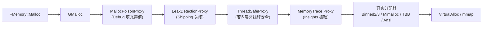

### 3.3 平台层选择默认分配器

`FPlatformMemory::BaseAllocator()` 是平台特化的工厂方法。Windows 平台的策略（`Runtime/Core/Private/Windows/WindowsPlatformMemory.cpp::FWindowsPlatformMemory::BaseAllocator`）可作典型：

```cpp
if (FORCE_ANSI_ALLOCATOR)                              AllocatorToUse = Ansi;
else if ((WITH_EDITORONLY_DATA||IS_PROGRAM) && MIMALLOC_ENABLED)
                                                       AllocatorToUse = Mimalloc;  // 编辑器/工具默认
else if ((WITH_EDITORONLY_DATA||IS_PROGRAM) && TBBMALLOC_ENABLED)
                                                       AllocatorToUse = TBB;
else if (USE_MALLOC_BINNED3)                           AllocatorToUse = Binned3;
else if (USE_MALLOC_BINNED2)                           AllocatorToUse = Binned2;   // Runtime 默认
else                                                   AllocatorToUse = Binned;
// 命令行参数 -ansimalloc / -mimalloc / -binnedmalloc2 / ... 可覆盖
```

可见：

- **Editor / Programs（窗口/工具进程）**：默认 **Mimalloc**（基于性能与峰值内存评测结果）。
- **Runtime（游戏运行）**：默认 **MallocBinned2/3**（针对游戏负载优化的 Bin/Slab 风格分配器）。
- **Debug 构建**或 `-stompmalloc` 等可切换到强校验分配器，便于排查越界/UAF。

---

## 4. 底层分配器实现：Binned / Mimalloc / TBB / Ansi

### 4.1 FMallocBinned2/3 —— UE 自研，针对游戏 Workload

`MallocBinned2.h` 中定义了 51 个 small bin（最大 ~32KB），每个 bin 对应一个固定 size class，多线程通过 TLS 缓存减少锁开销：

```
UE_MB2_SMALL_POOL_COUNT     = 51
UE_MB2_MAX_SMALL_POOL_SIZE  = 32KB - 16
UE_MB2_LARGE_ALLOC          = 65536  // > 64KB 走 OS 大块分配
```

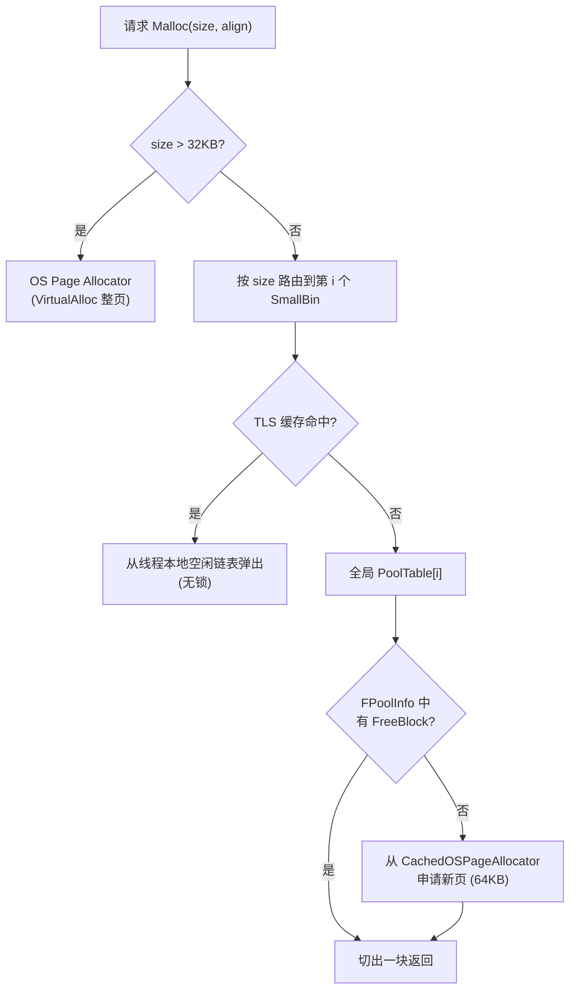

关键数据结构（`FMallocBinned2::FPoolInfo`）：

```cpp
struct FPoolInfo {
    uint16      Taken;           // 当前 pool 中已分配元素数
    ECanary     Canary;          // 哨兵值，越界检测
    uint32      AllocSize;       // 总字节数
    FFreeBlock* FirstFreeBlock;  // 空闲链表头
    FPoolInfo*  Next;
    FPoolInfo** PtrToPrevNext;
};
```

特征：
- **Slab + Bin** 架构（small pool）。
- **每线程 TLS Cache**：`SetupTLSCachesOnCurrentThread`、`ClearAndDisableTLSCachesOnCurrentThread`。
- 大页支持（`CachedOSVeryLargePageAllocator`），减少 TLB miss。
- **fork 支持**（`BINNED2_FORK_SUPPORT`）：使用不同 Canary 区分 pre-fork/post-fork 页，避免脏页 COW。
- 自带 `Trim(bool bTrimThreadCaches)` 把空闲页归还给 OS（低内存时）。

### 4.2 其他分配器一览

| 分配器 | 文件 | 适用场景 |
|--------|------|---------|
| `FMallocAnsi` | `MallocAnsi.h` | 简单包装 `malloc/free`，调试时使用 |
| `FMallocBinned`  | `MallocBinned.h` | 老版本（32-bit 也支持） |
| `FMallocBinned2` | `MallocBinned2.h` | 主流 64-bit 默认 |
| `FMallocBinned3` | `MallocBinned3.h` | 64-bit 进一步优化（虚拟内存预留更大） |
| `FMallocBinnedGPU` | `MallocBinnedGPU.h` | GPU 内存分配 |
| `FMallocMimalloc` | `MallocMimalloc.h` | Microsoft mimalloc 包装 |
| `FMallocTBB` | `MallocTBB.h` | Intel TBB scalable_malloc |
| `FMallocLibpas` | `MallocLibpas.h` | Apple libpas |
| `FMallocStomp/Stomp2` | `MallocStomp.h` | 每次 Malloc 都申请整页+守护页，命中即崩溃，定位越界 |
| `FMallocPoisonProxy` | `MallocPoisonProxy.h` | 释放后填充毒字节，定位 UAF |
| `FMallocLeakDetectionProxy` | `MallocLeakDetection.h` | 抓取分配栈用于泄漏分析 |
| `FMallocDoubleFreeFinder` | `MallocDoubleFreeFinder.h` | 检测重复 Free |
| `FMallocFrameProfiler` | `MallocFrameProfiler.h` | 帧粒度分配统计 |

### 4.3 持久线性分配器（Persistent Linear Allocator）

UE 还有一个特殊的 **永不释放** 分配器（`Memory/LinearAllocator.h`），用于存放生命周期等同进程的对象：

```cpp
struct FLinearAllocator {
    FLinearAllocator(SIZE_T ReserveMemorySize);  // 一次性 reserve 一块虚拟内存
    void* Allocate(SIZE_T Size, uint32 Alignment = 8);
    // 没有 Free —— 进程退出时整体释放
private:
    FCriticalSection Lock;
    FPlatformMemory::FPlatformVirtualMemoryBlock VirtualMemory;
    SIZE_T Reserved, Committed, CurrentOffset;
};

CORE_API FLinearAllocator& GetPersistentLinearAllocator();
```

它的核心用途：装载启动期就构造好、永不卸载的核心 UObject（CDO、引擎核心 Class 等）。详见下一节 UObject 分配。

---

## 5. 容器分配策略：TArray/TMap 等的内存来源

UE 容器（`TArray`, `TMap`, `TSet`, `FString`...）通过 **分配策略模板参数** 解耦内存来源，默认走 `FDefaultAllocator`：

```cpp
// Containers/ContainerAllocationPolicies.h
template<int IndexSize> class TSizedDefaultAllocator
    : public TSizedHeapAllocator<IndexSize> { ... };

using FDefaultAllocator = TSizedDefaultAllocator<32>;   // 32-bit index
```

`TSizedHeapAllocator::ForAnyElementType::ResizeAllocation` 内部最终调到：

```cpp
Data = (FScriptContainerElement*)BaseMallocType::Realloc(Data, NewMax * NumBytesPerElement);
// BaseMallocType 默认是 FMemory，因此最终走到 GMalloc
```

常用变体：

| 分配器 | 行为 | 典型用途 |
|--------|------|---------|
| `FDefaultAllocator` / `THeapAllocator` | 走 `FMemory::Malloc` | 默认 |
| `TInlineAllocator<N>` | 元素 ≤ N 时存于栈/对象内部，> N 才堆分配 | 已知小规模数组 |
| `TFixedAllocator<N>` | 固定容量，绝不堆分配 | 受限尺寸 |
| `TSetAllocator<HashAllocator, IndexAllocator>` | TSet/TMap 的 Hash 与索引各自一个分配器 | 哈希容器 |
| `FStackAllocator` | 配合 `FMemMark` 在栈式临时区 | 帧级临时 |
| `FAllocatorFixedSizeFreeList` | 固定大小对象的空闲链表 | 反复 new/delete 同尺寸对象 |

这意味着：**写代码 `TArray<FVector>` 时，每次 `Add` 触发 grow，最终是通过 `FMemory::Malloc → GMalloc → Binned2`**。

---

## 6. UObject 内存管理：从 NewObject 到对象表

### 6.1 UObject 是个特殊存在

UObject 不仅仅是一块堆内存，它还要：
- 注册到 **全局对象表** `GUObjectArray`（用于 GC、序列化、查找）；
- 拥有 `UClass` 元信息（CDO、属性表、原生函数表等）；
- 被 GC 管理（**不能用 `delete`**）。

### 6.2 对象创建三段式

应用层最常用的入口是 `NewObject<T>()`：

```mermaid
sequenceDiagram
    autonumber
    participant App as 用户代码
    participant NewObj as NewObject<T>()
    participant Static as StaticConstructObject_Internal
    participant Alloc as StaticAllocateObject
    participant UAlloc as FUObjectAllocator::AllocateUObject
    participant Init as FObjectInitializer / Class->ClassConstructor
    participant Array as GUObjectArray.AddUObject

    App->>NewObj: NewObject<UFoo>(Outer, Name, Flags)
    NewObj->>Static: 构造 FStaticConstructObjectParameters
    Static->>Alloc: StaticAllocateObject(Class, Outer, Name, Flags, ...)
    Alloc->>UAlloc: 计算 Size &amp; Align, 申请内存
    alt bAllowPermanent &amp;&amp; !PersistentDisabled
        UAlloc->>UAlloc: GetPersistentLinearAllocator().Allocate()
    else
        UAlloc->>UAlloc: FMemory::Malloc(Size, Align)
    end
    UAlloc-->>Alloc: UObjectBase* (zeroed memory)
    Alloc->>Array: 加入全局对象表，分配 InternalIndex
    Alloc-->>Static: UObject*
    Static->>Init: 调用 Class->ClassConstructor(FObjectInitializer)
    Init->>Init: 初始化属性、子对象、CDO 拷贝
    Init-->>App: 完整可用的 UObject*
```

### 6.3 `FUObjectAllocator::AllocateUObject`

```cpp
// CoreUObject/Private/UObject/UObjectAllocator.cpp
UObjectBase* FUObjectAllocator::AllocateUObject(int32 Size, int32 Alignment, bool bAllowPermanent)
{
    void* Result = nullptr;
    if (bAllowPermanent && !GPersistentAllocatorIsDisabled)
    {
        // 启动期/初始加载阶段：放入持久线性区，永不释放（不参与 GC sweep）
        Result = GetPersistentLinearAllocator().Allocate(Size, Alignment);
    }
    else
    {
        // 运行期：走 GMalloc
        Result = FMemory::Malloc(Size, Alignment);
    }
    return (UObjectBase*)Result;
}

void FUObjectAllocator::FreeUObject(UObjectBase* Object) const
{
    if (FPermanentObjectPoolExtents().Contains(Object) == false)
        FMemory::Free(Object);
    else
        check(GExitPurge);   // 持久区只在退出时整体释放
}
```

由此 UObject 实际位于**两块内存区域之一**：

- **持久区（Persistent Linear Allocator）**：启动初始加载时构造的 CDO、内置类等，地址范围用 `FPermanentObjectPoolExtents` 快速判定。
- **普通堆**（GMalloc）：运行期动态创建的 Actor、Component、临时 UObject 等。

`StaticAllocateObject`（`UObjectGlobals.cpp:3541`）的关键片段：

```cpp
int32 TotalSize = InClass->GetPropertiesSize();
int32 Alignment = FMath::Max(4, InClass->GetMinAlignment());
Obj = (UObject*)GUObjectAllocator.AllocateUObject(TotalSize, Alignment, GIsInitialLoad);
//                                                                    ↑
//                                                       仅初始加载阶段允许放进持久池
```

### 6.4 全局对象表 `GUObjectArray` —— `FChunkedFixedUObjectArray`

`UObject/UObjectArray.h`：

```cpp
typedef FChunkedFixedUObjectArray TUObjectArray;

class FChunkedFixedUObjectArray {
    enum { NumElementsPerChunk = 64 * 1024 };  // 每块 64K 个 FUObjectItem
    FUObjectItem** Objects;     // 二级表
    FUObjectItem*  PreAllocatedObjects;
    int32 MaxElements, NumElements, MaxChunks, NumChunks;
};
```

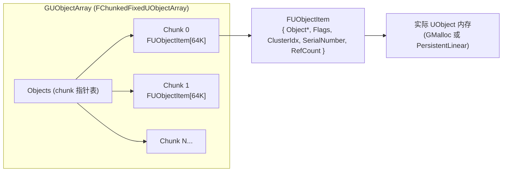

`FUObjectItem` 是关键的间接节点：

```cpp
struct FUObjectItem {
    UObjectBase* Object;        // 真实对象指针（可能被 packing 压缩到 Flags 中）
    int32 Flags;                // EInternalObjectFlags（Reachable / Unreachable / RootSet ...）
    int32 ClusterRootIndex;     // 所属 GC Cluster
    int32 SerialNumber;         // FWeakObjectPtr 用于失效检测
    int32 RefCount;             // 防止 GC 回收的强引用计数
    ...
};
```

特征：
- **指针稳定**（不会因扩容而搬移）—— 分块二级表 `Objects[ChunkIdx][WithinChunk]`，扩容只追加新块，已有 chunk 永不移动。这对多线程并发查询、`FWeakObjectPtr` 至关重要。
- 通过 `InternalIndex` 在表中定位，比指针更紧凑稳定。
- `FWeakObjectPtr` = `(InternalIndex, SerialNumber)`：当对象被销毁后表项的 `SerialNumber` 会改变，弱指针 deref 时一致性检查即可发现失效。

### 6.5 UObject 生命周期状态机

```mermaid
stateDiagram-v2
    [*] --> Allocated: StaticAllocateObject<br/>(分配内存, 加入表)
    Allocated --> Constructed: ClassConstructor<br/>FObjectInitializer
    Constructed --> Live: PostInitProperties<br/>PostLoad
    Live --> MarkedAsGarbage: MarkAsGarbage()<br/>(显式)
    Live --> Unreachable: GC 可达性分析<br/>未发现引用
    MarkedAsGarbage --> Unreachable: GC
    Unreachable --> BeingDestroyed: BeginDestroy()<br/>(异步资源释放)
    BeingDestroyed --> ReadyForFinishDestroy: IsReadyForFinishDestroy()
    ReadyForFinishDestroy --> Destroyed: FinishDestroy()
    Destroyed --> Freed: ~UObject() + FUObjectAllocator::FreeUObject<br/>(从 GUObjectArray 移除条目)
    Freed --> [*]
```

关键特点：**UObject 销毁是分两阶段的**（`BeginDestroy` → `FinishDestroy`），允许 GPU 资源等异步释放完成后再真正归还内存。

---

## 7. Garbage Collection：可达性分析与增量回收

UE 使用一个 **追踪式（Mark &amp; Sweep）GC**，主入口 `CollectGarbage`（`UObject/GarbageCollection.cpp:6140`）。

### 7.1 总流程

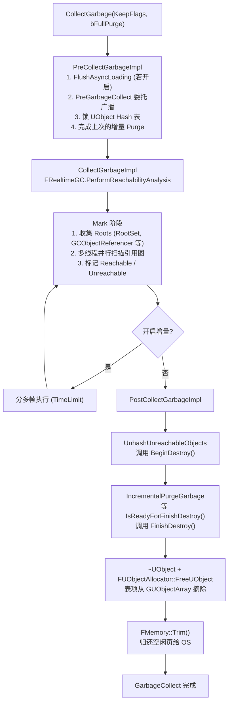

### 7.2 引用图来源

GC 扫描下列"根"以及它们能可达到的 UObject：

| Root 类别 | 来源 |
|----------|------|
| RootSet | `UObject::AddToRoot()` 显式标记的对象（资产管理器持有） |
| Native references | `UClass::AddReferencedObjects` 自动生成的反射扫描 + 手写 `AddReferencedObjects(InThis, Collector)` |
| `FGCObject` 注册者 | 通过 `UGCObjectReferencer::GGCObjectReferencer` 集中转发 |
| `FStrongObjectPtr<T>` | TStrongObjectPtr 内嵌 FGCObject 持有强引用 |
| `RefCount` > 0 的对象 | `FUObjectItem::RefCount` 锁定 |
| GC Cluster | `UObjectClusters` 把多个对象捆绑成一个根，加速 |

### 7.3 标记的实现：反射 Schema

每个 `UClass` 在编译期通过 **TPS（Token Property Stream）/Schema** 生成一份"该类内 UObject* 字段的偏移表"。GC Marker 用它在常量时间内枚举每个对象的 UObject 引用：

`UObject/GarbageCollectionSchema.h` 定义 `FSchemaView`，其中包括：

- `MemberOffset`：字段相对对象首地址的偏移；
- `Type`：是 `Object*` / `TArray<UObject*>` / `TMap<...>` / `Struct` / `WeakObjectPtr` 等；
- 嵌套结构体的 sub-schema。

`FRealtimeGC::PerformReachabilityAnalysis` 启动多个 worker，每个 worker 取一个 root，沿 schema 把对象的所有引用入队，BFS 遍历整个图。能并行是因为：**只对 `FUObjectItem::Flags` 做原子写**，而 UObject 内存不变。

### 7.4 增量 GC（5.x 新引擎默认特性）

`EGCOptions::IncrementalReachability` 启用后，可达性分析可以分帧执行，每帧给定一个 time budget，避免 GC 卡顿：

- 状态保存在 `GReachabilityState`（`FReachabilityAnalysisState`）；
- `PerformReachabilityAnalysisAndConditionallyPurgeGarbage(bUseTimeLimit)` 是节流入口；
- 上一次未完成 Mark 时，不能开始新的 GC Cycle，所以也叫"两阶段"GC。

**Garbage Elimination**（`EGCOptions::EliminateGarbage`）：把被标记 `RF_Garbage` 的对象当做"已死亡"，所有指向它的 raw `UObject*` 字段在标记阶段被自动清空（替换为 `nullptr`），避免悬空引用——这是 5.0+ 引入的 PendingKill 替代方案。

### 7.5 GC Clusters

为了缩短 GC 时间，UE 引入了 **Cluster** 概念：把"主对象 + 它必然存活的子对象"组合成一个不可分割的集合，在可达性分析时整族处理。

- 典型例子：`UStaticMesh` 及其内部 `UStaticMeshComponent` 关联的小对象。
- `FUObjectItem::ClusterRootIndex`：负值表示属于某 cluster；
- 入口：`UObjectBaseUtility::CreateClusterFromObject` / `UObjectClusters` 管理。

效果：上百个相关 UObject 对 GC 来说就 1 次扫描；当 cluster root 不可达，整个 cluster 一起回收。

---

## 8. 非 UObject 引用 UObject：`FGCObject`

C++ 中如果你的非 UObject 类（比如某 Manager、Subsystem、自定义工具）持有 `UObject*`，必须告诉 GC 别回收它，否则就是悬挂指针。

`UObject/GCObject.h` 提供了 **桥接机制**：

```cpp
class FGCObject {
public:
    static UGCObjectReferencer* GGCObjectReferencer;   // 常驻 RootSet 的全局 UObject

    FGCObject() { RegisterGCObject(); }                 // 自动注册
    virtual ~FGCObject() { UnregisterGCObject(); }      // 自动注销

    virtual void  AddReferencedObjects(FReferenceCollector& Collector) = 0;  // 报告强引用
    virtual FString GetReferencerName() const = 0;
};
```

`UGCObjectReferencer::AddReferencedObjects(InThis, Collector)` 会遍历所有注册的 `FGCObject`，把它们的引用统统提交给 Collector。GC 因此能"看见"这些来自 native 代码的引用。

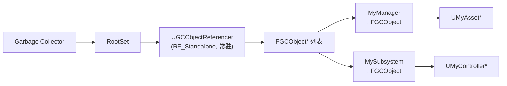

派生类示例：
```cpp
class FMyManager : public FGCObject {
    TArray<UObject*> CachedAssets;
public:
    virtual void AddReferencedObjects(FReferenceCollector& Collector) override
    { Collector.AddReferencedObjects(CachedAssets); }
    virtual FString GetReferencerName() const override { return TEXT("FMyManager"); }
};
```

辅助类：
- `TStrongObjectPtr<T>` / `FGCObjectScopeGuard`：RAII 包装器，构造时持有，析构时释放——内部就是个 FGCObject；
- `TWeakObjectPtr<T>`：弱引用，不阻止回收，访问时检查 SerialNumber 一致性；
- `TSoftObjectPtr<T>` / `FSoftObjectPath`：软引用，按路径懒加载，可能根本未加载。

---

## 9. 资产/资源管理：Package、Linker、AsyncLoading

游戏的"美术资源"在 UE 里也是 UObject——一个 `.uasset` 文件就是一个 `UPackage`，里面包含若干 `UObject`（如 `UTexture2D`, `UStaticMesh`, `UMaterial`）。所以**美术资源的内存管理 = UObject 管理 + 序列化/流式加载**。

### 9.1 加载链路

```mermaid
flowchart TB
    User["LoadObject<UTexture2D>(Outer, TEXT(\"/Game/T_Foo\"))"]
    User --> SLO["StaticLoadObject"]
    SLO --> LP["LoadPackage / LoadPackageAsync"]
    LP --> Linker["创建 FLinkerLoad"]
    Linker --> Hdr["读 PackageFileSummary<br/>(Name/Import/Export 表)"]
    Hdr --> Imp["导入表解析<br/>对依赖包递归 LoadPackage"]
    Imp --> Exp["导出表创建 UObject<br/>(StaticConstructObject_Internal)"]
    Exp --> Ser["对每个 Export 调用 Serialize()<br/>读属性 + BulkData 引用"]
    Ser --> PostL["PostLoad() 链<br/>(纹理上传 GPU、Mesh 构建 RenderResource)"]
    PostL --> Done["LoadFlags &amp; RF_NeedLoad 清除"]
    
    style LP fill:#e0f0ff
    style Ser fill:#fff0e0
```

关键文件：
- `CoreUObject/Public/UObject/Linker.h`、`LinkerLoad.h`：Linker 体系；
- `CoreUObject/Private/Serialization/AsyncLoading2.cpp`：**EDL/ZenLoader 异步加载主体**（`FAsyncLoadingThread2`）；
- `Engine/Classes/Engine/StreamableManager.h`：高层级 `FStreamableManager`，把 SoftObjectPath 异步解析。

### 9.2 异步加载（Async Loading 2 / Zen Loader）

UE5 默认使用 **AsyncLoading2**（也叫 EDL/Zen），相比 UE4 的 LinkerLoad 有质的提升：

- 数据驱动的依赖图（IoStore + .ucas/.utoc）：导出和导入预先排好序，加载时几乎"流式" `memcpy`；
- 工作流分布在多个后台线程（IO 线程、Decompress 线程、Game-Thread Tickable 阶段）；
- 与 GC 协作：加载期间通过 `FAsyncLoadingThread::IsAsyncLoading()` 让 `CollectGarbageInternal` flush 一次（避免引用半成品）。

```mermaid
sequenceDiagram
    participant GT as Game Thread
    participant ALT as AsyncLoading Thread
    participant IO as IO Dispatcher
    participant Pkg as Package State Machine

    GT->>ALT: LoadPackageAsync(Path, OnComplete)
    ALT->>IO: ReadPackageHeader (异步)
    IO-->>ALT: Header Bytes
    ALT->>Pkg: ProcessPackageSummary -> WaitingForImports
    ALT->>IO: 触发 Import 包加载（递归）
    IO-->>ALT: All imports done
    ALT->>Pkg: CreateExports (StaticAllocateObject)
    ALT->>Pkg: SerializeExports (Tick 时分批)
    ALT->>GT: 提交 PostLoad 任务
    GT->>GT: PostLoad() (主线程)
    GT->>GT: BroadcastOnComplete
```

### 9.3 Package 卸载

`UPackage` 也是 UObject。一个加载完的包：
1. 保留对其所有 `UObject` 的间接引用（通过 outer 链 `UObject::GetOutermost()`）。
2. 包内 UObject 不持有任何外部强引用、不在 RootSet、不被 FGCObject 引用时，**整包随 GC 一起回收**。
3. 调用 `UnloadPackage(Package)` / `World->RemoveFromRoot()` 后下一次 GC 即被清理。

---

## 10. BulkData 与流式资产（纹理/Mesh Streaming）

资产的"重数据"（纹理像素、顶点缓冲、动画曲线 raw）不会和 UObject 一起放在内存中，而是通过 **`FBulkData`** 按需加载/卸载。

### 10.1 FBulkData 基础

`Serialization/BulkData.h`：

```cpp
class FBulkData {
    struct FAllocatedPtr {
        union FAllocation {
            void* RawData;                           // FMemory::Malloc/Realloc 普通堆
            FOwnedBulkDataPtr* MemoryMappedData;     // mmap 文件映射
        };
        FAllocation Allocation{ nullptr };
    };
    FAllocatedPtr DataAllocation;
    int64  BulkDataSize;
    int64  BulkDataOffsetInFile;
    uint32 BulkDataFlags;     // BULKDATA_PayloadAtEndOfFile / SerializeCompressed / MemoryMapped...
    ...
public:
    void* Lock(uint32 LockFlags);   // 触发按需加载
    void  Unlock();
    void  Realloc(int64 InElementCount);
    void  RemoveBulkData();         // 释放内存中的副本（盘上仍在）
};
```

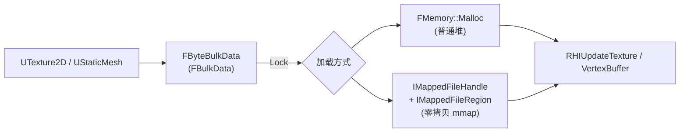

关键点：
- **BulkData 不是 UObject**——内部用 `FMemory::Malloc/Realloc` 自管理，与 GC 无关；其生命周期挂在拥有它的 UObject 上。
- 启用 `BULKDATA_MemoryMapped` 后，可以直接 `mmap` 整段数据到只读虚拟地址，省去拷贝（移动平台/Console 常用）。
- 序列化时 BulkData 通常**不在主 .uasset 中**，而在 `.ubulk` / `.uptnl`（payload 包）中按 offset 寻址。

### 10.2 纹理/Mesh Streaming

`Engine/Private/ContentStreaming.cpp` 中 `FStreamingManagerCollection` 持有：

- `RenderAssetStreamingManager : IRenderAssetStreamingManager`
- `AudioStreamingManager`
- `AnimationStreamingManager`、`VirtualTextureStreamingManager` 等

`FRenderAssetStreamingManager` 每帧根据：
- 摄像机位置 + 物体大小（Texture Streaming Volume / TextureGroup Bias）；
- 当前 GPU 显存占用；
- 用户提示（`PrestreamTextures`、`Force Resident` 等）；

决策应当 **加载/卸载哪一级 mip / LOD**。

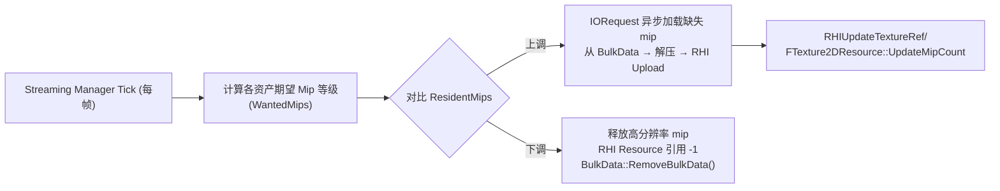

涉及内存的 3 个层次：
1. **BulkData 内存**（`FMemory`/mmap）—— 临时缓冲，加载完成上传给 RHI 后释放；
2. **GPU 资源** —— 由 RHI 引用计数管理（下一节）；
3. **UObject 的"代理"**（`UTexture2D` 自身）—— 普通 GC 对象，常驻直到没有引用。

---

## 11. GPU/RHI 资源的引用计数管理

GPU 端对象（纹理、Buffer、Shader、Pipeline State 等）通过 `FRHIResource` 与 `TRefCountPtr` 管理，**不参与 UObject GC**——它们生命周期更短、更受 RHI 线程调度影响。

### 11.1 FRHIResource

`RHI/Public/RHIResources.h`：

```cpp
class FRHIResource {
public:
    FORCEINLINE_DEBUGGABLE uint32 AddRef()  const { return AtomicFlags.AddRef(...);  }
    FORCEINLINE_DEBUGGABLE uint32 Release() const {
        int32 NewValue = AtomicFlags.Release(std::memory_order_release);
        if (NewValue == 0) MarkForDelete();      // 不立即 delete！
        return uint32(NewValue);
    }
protected:
    virtual ~FRHIResource();   // 受保护，禁止外部 delete
private:
    class FAtomicFlags {
        // 30 位引用计数 + 1 bit MarkedForDelete + 1 bit Deleting
        std::atomic_uint Packed = { 0 };
        ...
    } AtomicFlags;
    static void DeleteResources(TArray<FRHIResource*> const& Resources);
};
```

特征：
- **Release → 0 不立即析构**，而是 `MarkForDelete()` 把对象塞入 RHI 删除队列，由 RHI Thread 选择合适时机批量销毁——避免 GPU 还在使用时 host 端析构造成 GPU hang。
- `bAllowExtendLifetime`：允许把生命周期延长到下一个 RHI submit 完成后。
- 资源信息追踪（`RHI_ENABLE_RESOURCE_INFO`）用于诊断。

### 11.2 TRefCountPtr 智能指针

```cpp
template<typename T>
class TRefCountPtr {
    T* Reference;
public:
    TRefCountPtr(T* p) { Reference = p; if (p) p->AddRef(); }
    ~TRefCountPtr()    { if (Reference) Reference->Release(); }
    // 拷贝/移动语义保证引用计数正确
};
```

UE 提供大量类型别名（`FTextureRHIRef`, `FBufferRHIRef`, `FShaderResourceViewRHIRef` 等）都是 `TRefCountPtr` 的 typedef。

### 11.3 与 UObject 的关系

`UTexture2D` 是 UObject，里面持有 `FTextureResource* Resource`（render side）。
`FTextureResource` 含 `FTextureRHIRef`（即 `TRefCountPtr<FRHITexture>`）。

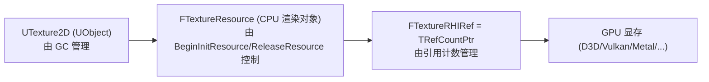

销毁顺序：
1. `UTexture2D` 不可达 → GC 标记 → `BeginDestroy()`：调用 `BeginReleaseResource(Resource)`（投递到 Render Thread）；
2. Render Thread 执行 `FTextureResource::ReleaseRHI()` → `TextureRHI = nullptr` → 引用计数归零 → `MarkForDelete`；
3. RHI Thread 在合适的栅栏后真正 delete；
4. `FinishDestroy()` 之前会 `IsReadyForFinishDestroy()` 检查 release fence，等 GPU 真的释放完才允许；
5. 最后 `~UTexture2D()`，`FUObjectAllocator::FreeUObject` 归还堆内存。

可见 **UObject 双阶段 destroy + RHI 引用计数 + 删除队列** 三者协同，避免 CPU/GPU race。

---

## 12. 内存追踪与诊断：LLM、MemoryTrace、各种 Proxy

UE 提供了多个工具来观测和诊断内存：

### 12.1 LLM (Low-Level Memory Tracker)

`HAL/LowLevelMemTracker.h`：

```cpp
LLM_SCOPE(ELLMTag::Texture);              // 当前作用域内的所有分配挂到 "Texture" 标签
LLM_SCOPE_BYTAG(UObject_StaticAllocateObject);
LLM_SCOPE_DYNAMIC(LLMScope_Name, ELLMTracker::Default, ELLMTagSet::UObjectClasses, ...);
```

实现原理：
- 每次 `FMemory::Malloc/Free` 通过 `MemoryTrace_Alloc/Free` hook，把 `(Ptr, Size, Tag)` 关联起来；
- TLS 存当前 Tag 栈，Free 时反查；
- 可在控制台 `stat LLM` / `stat LLMFull` 查看分类占用。

### 12.2 MemoryTrace（Unreal Insights）

`MemoryTrace_*` 一组 API，把 alloc/free 事件以 trace 协议写到 Insights，可离线分析峰值、leak、按 callstack 聚合等。

### 12.3 调试型分配器

| 调试器 | 触发 | 用途 |
|--------|------|------|
| `-stompmalloc` | `FMallocStomp/Stomp2` | 每个分配独占整页+守卫页，越界即页错误 |
| `-poisonmalloc` | `FMallocPoisonProxy` | 释放后填充毒值，检测 UAF/未初始化 |
| `MALLOC_LEAKDETECTION` | `FMallocLeakDetectionProxy` | 抓 callstack，统计泄漏 |
| `MALLOC_VERIFY` | `FMallocVerifyProxy` | 每次操作校验堆 |
| `FMallocDoubleFreeFinder` | 自动 | 双重释放检测 |

### 12.4 GC 调试

- `gc.DumpReferencerChains` / `obj refs name=X`：查谁引用了对象 X，常用于"为什么不被回收"。
- `FReferenceChainSearch`（`UObject/ReferenceChainSearch.h`）：自动反向搜索引用链。
- `gc.HistoryDepth`：保留最近几次 GC 的引用快照。

---

## 13. 总结：UE 中"对象"的生死全景图

把所有要点合到一张图：

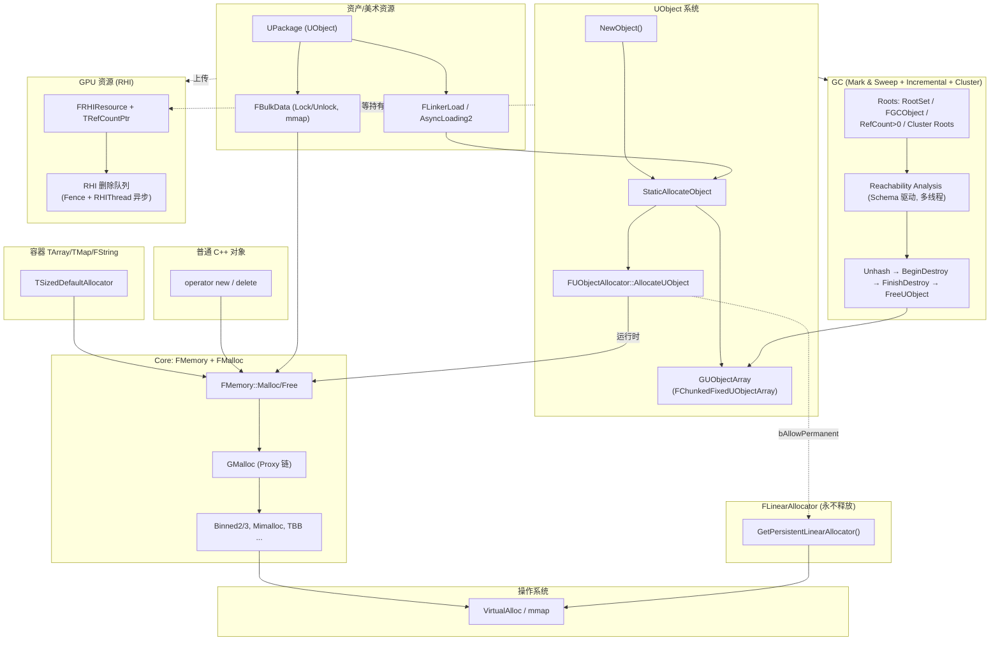

### 一句话记忆

| 对象类型 | 内存来源 | 生命周期 |
|---------|---------|---------|
| 临时 buffer / 容器 / `new` 对象 | `FMemory::Malloc` → `GMalloc` | 显式 `delete`/`Free`；容器自动 |
| 启动期核心 UObject（CDO 等） | `FLinearAllocator`（永久区） | 进程退出才释放 |
| 运行期 UObject（Actor/Component/Asset） | `FMemory::Malloc` + `GUObjectArray` | **GC 自动回收**（不可达） |
| 非 UObject 但持有 UObject* | 自身随便分配，但需继承 `FGCObject` | 通过 `AddReferencedObjects` 让 GC 看见 |
| 美术资源原始数据（mip/顶点） | `FBulkData`（堆 or mmap） | 跟随宿主 UObject + Streaming Manager 调度 |
| GPU 资源（Texture/Buffer/Shader） | `FRHIResource`，引用计数 | Release→0 后入 RHI 删除队列异步释放 |

### 设计思想精炼

1. **抽象与代理**：`FMalloc` 是核心抽象，所有特性（线程安全、毒值、追踪、泄漏检测）通过 Proxy 链叠加，按需拼装。
2. **分层与定制**：通用堆走 Binned，永久对象走 Linear，容器走带索引 Allocator，GPU 走引用计数——不同生命周期与访问模式各得其所。
3. **元数据驱动 GC**：UClass + Schema 让 GC 在不写任何 visit 代码的情况下完成全图遍历，可达性分析能并行化、增量化。
4. **CPU/GPU 协同**：UObject 双阶段销毁（`BeginDestroy`/`FinishDestroy`）+ RHI 引用计数 + 删除队列，确保跨线程跨设备资源安全释放。
5. **可观测性优先**：LLM 分类标签、MemoryTrace 协议、Insights 工具链一体化，定位泄漏、抖动、峰值都有第一方支持。

---

> 本文涉及到的关键源码路径速查：
> - `Engine/Source/Runtime/Core/Public/HAL/MemoryBase.h` —— `FMalloc` 接口
> - `Engine/Source/Runtime/Core/Public/HAL/UnrealMemory.h` —— `FMemory` 静态 API
> - `Engine/Source/Runtime/Core/Private/HAL/UnrealMemory.cpp` —— `GCreateMalloc()` 链
> - `Engine/Source/Runtime/Core/Public/HAL/MallocBinned2.h` —— Binned2 实现
> - `Engine/Source/Runtime/Core/Public/Memory/LinearAllocator.h` —— 持久线性分配器
> - `Engine/Source/Runtime/Core/Public/Containers/ContainerAllocationPolicies.h` —— 容器分配策略
> - `Engine/Source/Runtime/CoreUObject/Public/UObject/UObjectAllocator.h` 与 `Private/UObject/UObjectAllocator.cpp` —— UObject 内存
> - `Engine/Source/Runtime/CoreUObject/Public/UObject/UObjectArray.h` —— `FChunkedFixedUObjectArray`
> - `Engine/Source/Runtime/CoreUObject/Public/UObject/GarbageCollection.h` 与 `Private/UObject/GarbageCollection.cpp` —— GC 主循环
> - `Engine/Source/Runtime/CoreUObject/Public/UObject/GCObject.h` —— 非 UObject 桥接
> - `Engine/Source/Runtime/CoreUObject/Public/UObject/UObjectGlobals.h` 与 `.cpp` —— `NewObject` / `StaticAllocateObject` / `LoadObject`
> - `Engine/Source/Runtime/CoreUObject/Private/Serialization/AsyncLoading2.cpp` —— 现代异步加载
> - `Engine/Source/Runtime/CoreUObject/Public/Serialization/BulkData.h` —— BulkData
> - `Engine/Source/Runtime/Engine/Private/ContentStreaming.cpp` —— 资产流送
> - `Engine/Source/Runtime/RHI/Public/RHIResources.h` —— `FRHIResource` 引用计数
